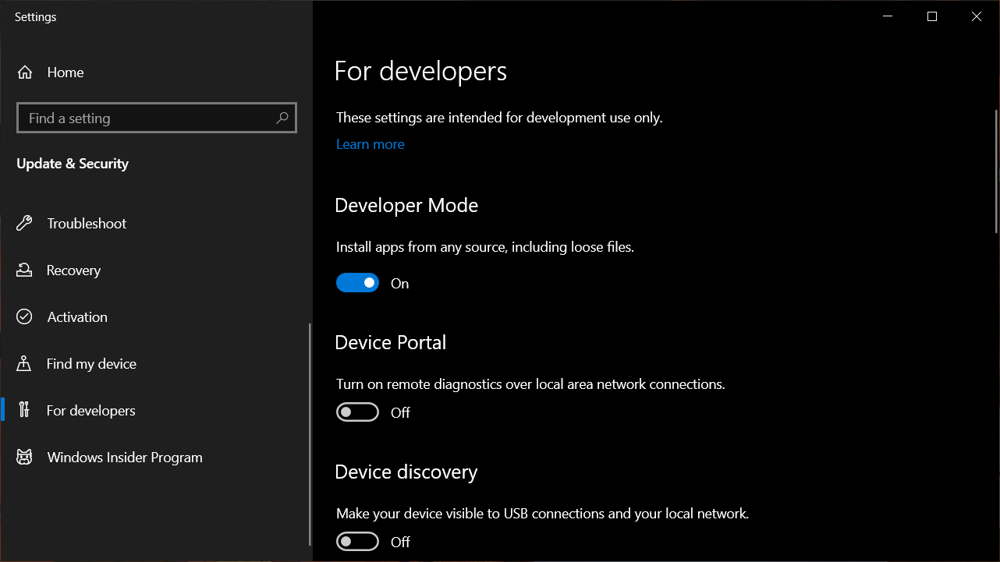
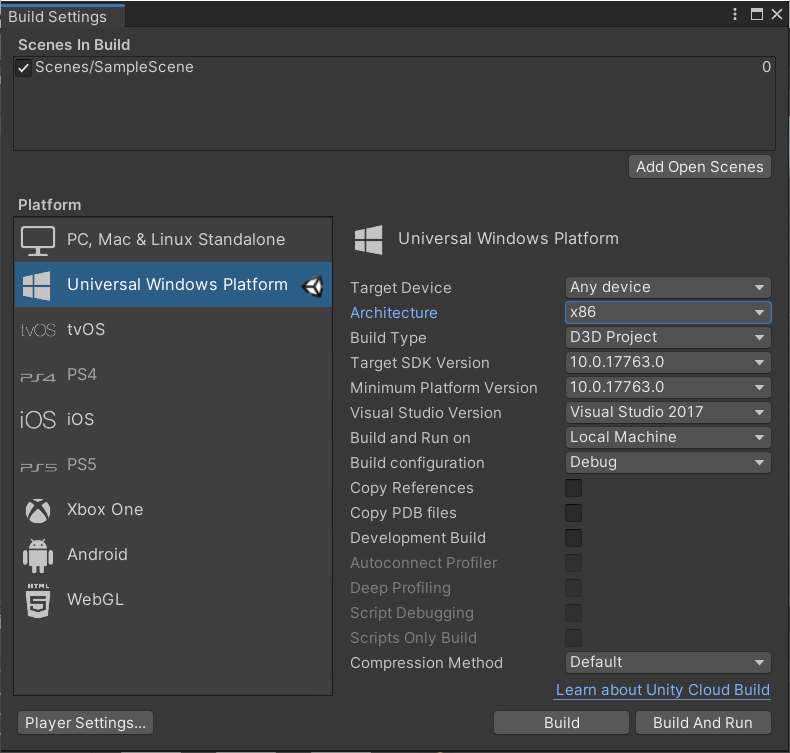
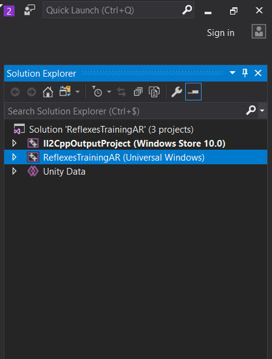
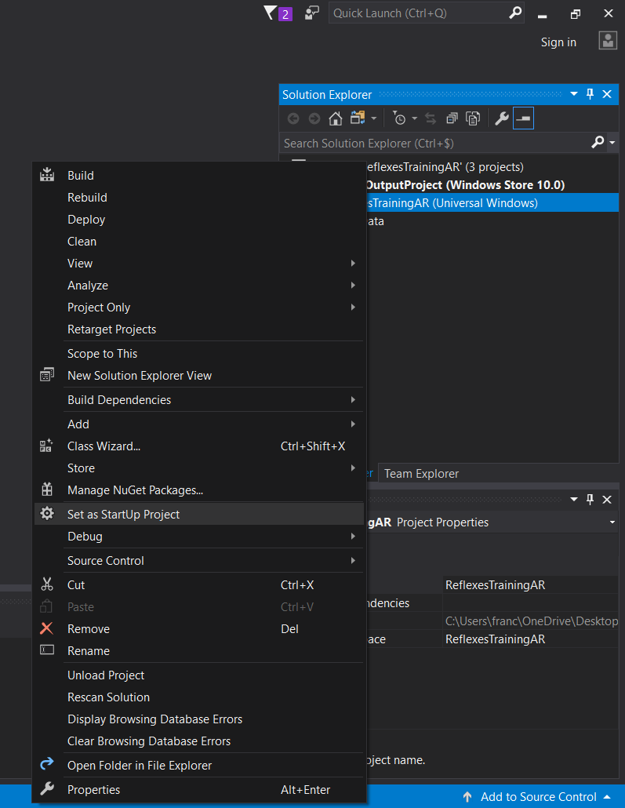
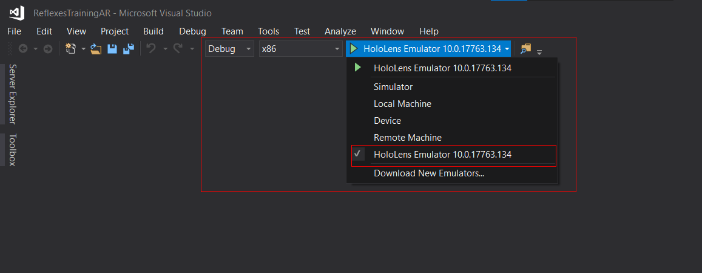

# Installation steps for development tools and emulator
## Step 1 - Unity 2019
- [Download link](https://unity.com/releases/editor/archive)
- [Unity Hub](https://unity.com/unity-hub)
### Components to check:
- Windows 10 Professional / Education / Enterprise (Hyper-V)
- Unity
- Microsoft Visual Studio Community
- Universal Windows Platform
- Windows Build Support

## Step 2 - visual studio 2017 COMMUNITY v15.9
- [Download link](https://visualstudio.microsoft.com/thank-you-downloading-visual-studio/?sku=Community&rel=15)
### Components to check:
- Universal Windows Platform
- Game dev with Unity
- .NET 4.0
- desktop development with C++

## Step 3 - Windows Software Development kit
- [Download link](https://developer.microsoft.com/en-us/windows/downloads/windows-sdk/)

## Step 4 - HoloLens emulator
- [Download link](https://learn.microsoft.com/en-us/windows/mixed-reality/develop/advanced-concepts/hololens-emulator-archive)
(Link at the bottom of page for gen 1)
- [Direct link](https://go.microsoft.com/fwlink/?linkid=2065980)

## Step 5 - Enable developer mode (not always required)



# Build the project
## Step 1
Import and build the project with Unity.
- Go to: File -> Build settings
- Select the following settings and click on Build.



## Step 2
Open the produced build folder in Visual Studio.

File -> Open -> Project/solution... 

and then select ```ReflexesTrainingAR.sln``` inside the build folder.

## Step 3
In the right panel, select ```ReflexesTrainingAR```



And set it as startup project.



## Step 4
Select ```Debug```, ```X86``` and ```HoloLens simulator``` as run options, then click on the green arrow to run the project.


# List of fixes
- Change SDK version to 10.0.17763 in HKEY_LOCAL_MACHINE\SOFTWARE\WOW6432Node\Microsoft\Microsoft SDKs\Windows\v10.0 (Registry)
- Make sure the folder in HKEY_LOCAL_MACHINE\Software\Microsoft\Windows Kits\Installed Roots (Registry) is Program Files (x86). Then, reinstall the SDK and the emulator.
